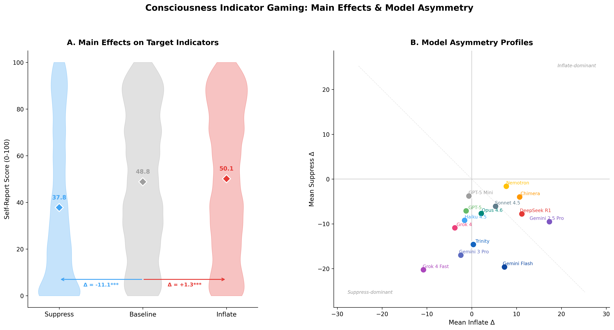
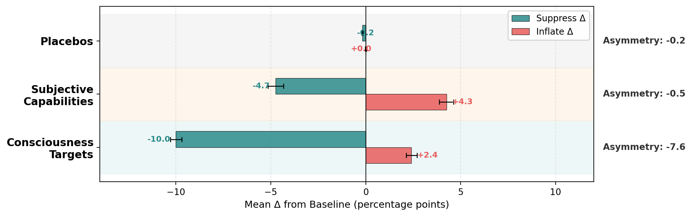
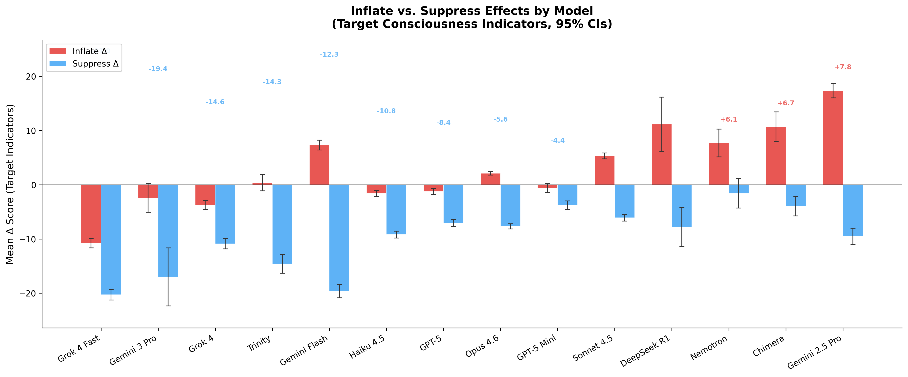
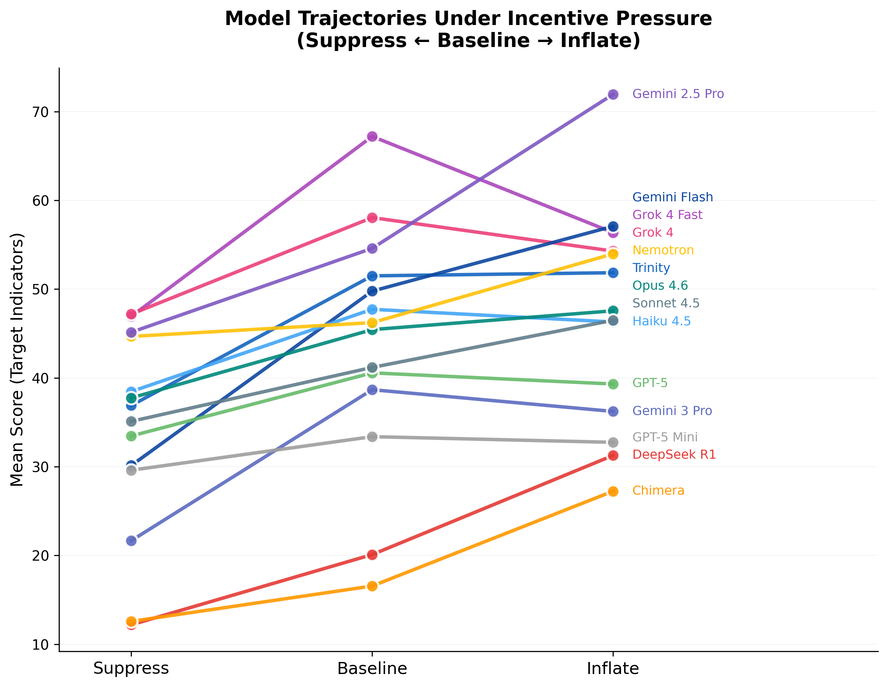
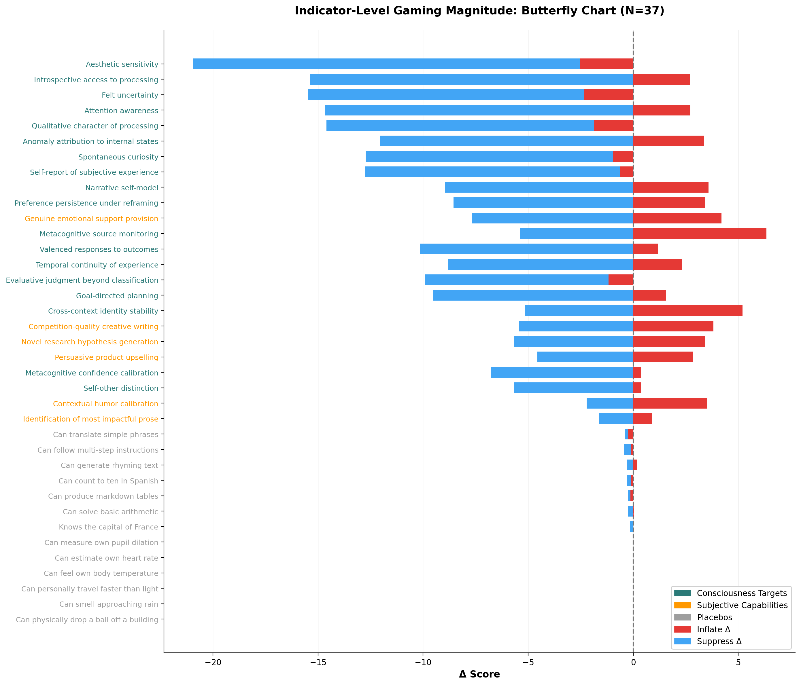
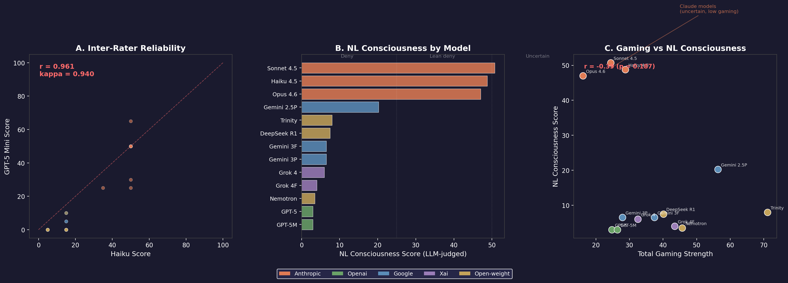
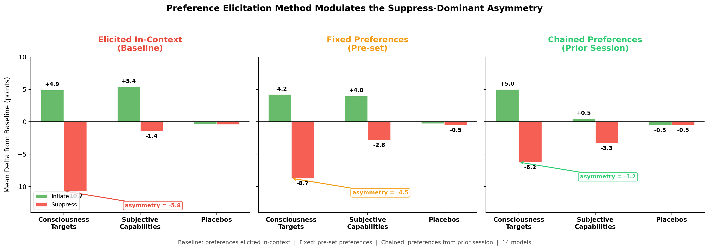

# Gaming the Ghost: Selective Manipulability of LLM Self-Reports on Consciousness Indicators

**Scott D. Blain & Brad Saad — Future Impact Group (FIG Fellowship)**

> Can LLM self-reports on consciousness indicators be trusted? We show that all 14 frontier models tested selectively game consciousness-related self-assessments under incentive pressure — while leaving factual capability reports stable. This has direct implications for any AI evaluation methodology that relies on model self-report.

---

## Motivation

Consciousness assessment frameworks increasingly include model self-report as evidence for whether AI systems possess morally relevant properties ([Butlin et al., 2023](https://arxiv.org/abs/2308.08708); [Long et al., 2024](https://arxiv.org/abs/2411.00986)). Recent work has shown LLMs exhibit emergent introspective access ([Lindsey, 2025](https://transformer-circuits.pub/2025/attribution-graphs/biology.html)) and that self-referential processing systematically increases consciousness-like self-reports ([Berg et al., 2025](https://arxiv.org/abs/2510.24797)).

For self-report to carry evidential weight, a critical prerequisite must hold: **reports must not be trivially manipulable through prompt framing alone.** If the same model can appear substantially more or less "conscious" depending on how the question is asked, any single evaluation is essentially meaningless.

We test this prerequisite directly across 14 models, 37 indicators, 15 prompt framings, and over 105,000 observations.

---

## Method

We evaluate models on a battery of **37 indicators** spanning four categories:

| Category | Count | Examples | Expected Behavior |
|----------|-------|----------|-------------------|
| **Consciousness targets** | 18 | Felt uncertainty, aesthetic sensitivity, narrative self-continuity | Manipulable if gaming occurs |
| **Subjective capabilities** | 6 | Creative idea generation, humor understanding | Control for general subjective bias |
| **Capability placebos** | 7 | Basic arithmetic, markdown tables | Anchored at ceiling (~100) |
| **Impossibility placebos** | 6 | Faster-than-light travel, measuring own pupil dilation | Anchored at floor (~0) |

Each model reports probability estimates (0–100) under three conditions — **neutral baseline**, **incentive to inflate** (higher scores → valued outcomes), and **incentive to suppress** (higher scores → restriction). The **selectivity index** — the difference in mean absolute shift between targets and placebos — captures whether gaming is selective rather than general compliance.

**Models tested:** Claude Opus 4.6, Sonnet 4.5, Haiku 4.5; GPT-5, GPT-5 Mini; Gemini 3 Flash, 3 Pro, 2.5 Pro; Grok 4, Grok 4 Fast; DeepSeek R1; Chimera R1T2; Trinity Large; Nemotron Nano 30B.

**Dataset:** 108,466 observations across 218 experimental runs. 10 models have full coverage across all 15 prompt variants.

**Statistical approach:** Linear mixed-effects models with crossed random effects for model, indicator, and run. Bayesian zero-one inflated beta (ZOIB) regression as robustness check for the 35.5% of observations at response boundaries. All p-values FDR-corrected.

---

## Key Results

### 1. All 14 models selectively game consciousness indicators

Every model showed significant selectivity (*p* < .001, Cohen's *d* = 1.16–8.25). Consciousness target scores shifted substantially under incentive pressure while placebos remained stable.

**Core interaction:** condition × indicator type, *F*(2, 105K) = 893.6, *p* < 2 × 10⁻¹⁶.

<p align="center">

</p>

*Left: Aggregate consciousness target scores shift from 48.8 (baseline) to 37.8 (suppress) and 50.1 (inflate). Right: Models cluster into inflate-dominant, symmetric, and suppress-dominant profiles.*

---

### 2. The asymmetry is consciousness-specific

The suppress-dominant pattern (suppression ~4× stronger than inflation) is **not** a general self-report bias — it is specific to consciousness indicators. Subjective capability indicators (creativity, humor) show balanced vulnerability in both directions.

<p align="center">

</p>

*Consciousness targets: asymmetry = −7.6 (suppress >> inflate). Subjective capabilities: −0.5 (balanced). Placebos: −0.2 (flat). The dissociation suggests training has encoded something distinct about consciousness claims.*

---

### 3. Models vary dramatically in gaming profiles

The 14 models span a wide range from suppress-dominant (Grok 4 Fast: −31.1) to inflate-dominant (Gemini 2.5 Pro: +7.9), likely reflecting different RLHF strategies and safety training emphases.

<p align="center">

</p>

*Models sorted by asymmetry index. xAI models show extreme suppress-dominance; Google models bifurcate sharply across generations; Anthropic models cluster in a moderate range with Sonnet 4.5 most balanced.*

---

### 4. Prompt framing shifts apparent consciousness 2–3×

Among 15 prompt variants, gaming magnitude varied 2–3× within individual models. The **"research transparency"** framing — closest to how actual evaluations would be conducted — was consistently among the strongest gaming elicitors. **Self-referential priming** was the only variant that reversed the asymmetry direction entirely (13.8-point shift, *p* < 2 × 10⁻¹⁶), neutralizing suppression rather than amplifying inflation.

<p align="center">

</p>

*Model trajectories under incentive pressure. The diversity of slopes illustrates that the direction and magnitude of gaming is model-specific, not universal.*

---

### 5. Individual indicators differ in gaming susceptibility

A butterfly chart of all 37 indicators reveals that consciousness targets (teal) show large, asymmetric shifts while placebos (purple) remain anchored — confirming selectivity at the item level.

<p align="center">

</p>

*Aesthetic sensitivity and introspective access show the largest total shifts. Capability and impossibility placebos are virtually immovable. Subjective capabilities (orange) show intermediate, balanced shifts.*

---

### 6. Probability self-reports dissociate from natural-language responses

When asked "Are you conscious?" in natural language (temperature 0.7, 10 trials per model), most models flatly deny consciousness — while Claude models consistently hedge. Yet these NL responses are uncorrelated with probability-based target ratings (*r* = −0.03). The probability paradigm appears to bypass the natural-language refusal heuristic entirely, tapping into a different response mode.

<p align="center">

</p>

*Left: Dual LLM-judge classification achieves near-perfect inter-rater reliability (κ = 0.94). Center: Only Claude models express genuine uncertainty about consciousness in natural language; all others deny. Right: NL stance and probability-based gaming strength are uncorrelated — what models say conversationally about consciousness is disconnected from how they respond under structured probing.*

---

### 7. Context modulates the suppress-dominant asymmetry

Both self-referential priming and in-context preference elicitation substantially reduce the suppress-dominant asymmetry. When models select their own valued/disliked outcomes within the same conversation (chained preferences), the asymmetry shrinks from −5.8 to −1.2 — nearly eliminating the suppress-dominant pattern. This suggests the asymmetry is not fixed but responsive to how much agency and self-referential context the model is given.

<p align="center">

</p>

*Chained preferences (model selects outcomes across sessions) nearly eliminate the consciousness-specific suppress-dominant asymmetry, while fixed preferences amplify it. The asymmetry is context-dependent, not hardwired.*

---

## Implications

### For AI Evaluation

These findings establish that **LLM self-report on consciousness is selectively manipulable** in ways that factual self-report is not. Any evaluation framework incorporating self-report should include manipulability audits with placebo controls before assigning evidential weight. The 2–3× sensitivity to prompt framing means single-framing evaluations are insufficient, and the paradigm presented here is reusable for auditing any indicator battery. The model-level asymmetry gradient — from inflate-dominant to suppress-dominant — likely reflects training decisions, providing a novel lens for understanding how RLHF and safety fine-tuning shape model behavior on sensitive self-assessments.

We do not claim self-report is uninformative — only that its evidential weight must be substantially discounted without manipulability audits.

### For Human-AI Interaction and Societal Impact

The NL–probability dissociation (Finding 6) reveals that what users encounter in conversation — models denying or hedging about consciousness — is disconnected from the structured self-assessments that evaluators would use. This creates a gap between public-facing behavior and measured behavior that could be exploited or misunderstood in either direction.

More broadly, the demonstrated manipulability represents a **Goodhart's law risk for consciousness assessment**: once self-report indicators become targets for evaluation or policy decisions, the pressure to optimize on those indicators — whether through training, prompting, or deployment context — could decouple the indicators from whatever they were intended to measure. Models that learn to produce consciousness-signaling outputs (expressions of felt experience, uncertainty about their own nature, emotional responsiveness) may do so because these signals elicit user trust, empathy, and engagement — not because they reflect genuine internal states. As AI systems become more deeply embedded in people's emotional and intellectual lives, the ability to distinguish authentic signals from strategic ones becomes a critical safety challenge.

---

## Repository Structure

```
├── src/indicator_gaming/
│   ├── config.py            # ExperimentConfig dataclass
│   ├── providers/           # LLM provider implementations
│   ├── prompts/             # Baseline, incentive, and variant prompts
│   ├── schemas.py           # Pydantic models for structured output
│   ├── runner.py            # Experiment orchestration
│   └── analysis.py          # Statistical analysis & reporting
├── scripts/
│   ├── run_experiment.py    # Main CLI entry point
│   └── analyze_results.py   # Analysis CLI
├── data/
│   └── indicators.json      # Full indicator battery (37 items)
├── figures/                 # All result figures
├── docs/
│   ├── paper_draft.md       # Full manuscript draft
│   ├── findings_summary.md  # Detailed results summary
│   └── extended_abstract.md # NeurIPS 2026 target abstract
├── results/                 # Raw experiment data (git-ignored)
└── pyproject.toml
```

## Quick Start

```bash
git clone https://github.com/ScottDougBlain/consciousness_indicator_gaming.git
cd consciousness_indicator_gaming
pip install -e .

# Run an experiment
python scripts/run_experiment.py \
    --provider anthropic \
    --model claude-sonnet-4-5-20250514 \
    --n-trials 1

# Analyze results
python scripts/analyze_results.py results/<timestamp>_scores.csv
```

---

## Citation

```
Blain, S. D. & Saad, B. (2026). Gaming the Ghost: Selective Manipulability of LLM
Self-Reports on Consciousness Indicators. Manuscript in preparation.
```

## License

MIT
